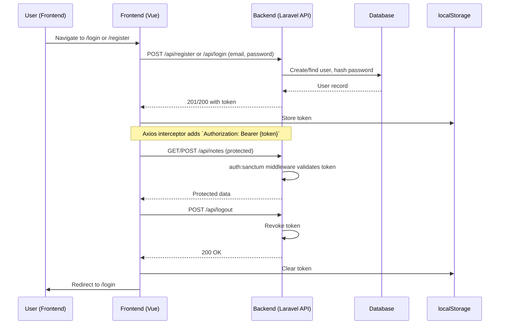

# Authentication Implementation Plan

## Overview
This project is a Laravel backend with Vue.js SPA frontend for note management. Sanctum is partially configured (migration for personal_access_tokens exists, `/user` route protected). Current notes API routes are unauthenticated. Goal: Implement full authentication using Laravel Sanctum for API token auth, suitable for SPA.

**Key Assumptions:**
- Email/password registration/login.
- Token-based auth (stored in localStorage, sent via Authorization header).
- Users own their notes (add `user_id` to notes if not present).
- No social logins initially.

## Authentication Flow Diagram

## Step-by-Step Implementation Plan

### Backend (Laravel)
1. **Complete Sanctum Setup**
   - Ensure `User` model uses `HasApiTokens` trait: [`app/Models/User.php`](app/Models/User.php)
   - Run `php artisan migrate` if personal_access_tokens not migrated.
   - Add `user_id` foreign key to notes table/migration if missing: Update [`database/migrations/2025_11_17_111547_create_notes_table.php`](database/migrations/2025_11_17_111547_create_notes_table.php), add to `Note` model `$fillable`, migrate fresh or add new migration.

2. **Create AuthController**
   - New file: `app/Http/Controllers/AuthController.php`
   - Methods: `register(Request $request)`, `login(Request $request)`, `logout(Request $request)`, `me(Request $request)`

3. **Update Routes**
   - `routes/api.php`: Add auth routes (public: register/login; protected: logout/me)
   - Protect notes routes: `Route::middleware('auth:sanctum')->group(...)`

4. **Update NoteController**
   - Inject `Auth` or use `$request->user()` to scope notes to `auth()->id()`
   - Policies: Create `NotePolicy` for ownership checks.

5. **Environment**
   - `.env`: Set `SESSION_DRIVER=cookie`, Sanctum domains.

### Frontend (Vue.js)
1. **Auth Components**
   - `resources/js/pages/LoginPage.vue`, `resources/js/pages/RegisterPage.vue`
   - Forms with email/password, API calls.

2. **API Client Updates**
   - `resources/js/api/auth.js`: New module for auth endpoints.
   - Update `resources/js/api/notes.js`: Use axios instance with auth interceptor.
   - Handle 401: Clear token, redirect to login.

3. **State Management**
   - Pinia store: `stores/auth.js` for user/token, persist with plugin.

4. **Routing**
   - `resources/js/router.js`: Add `/login`, `/register`; guards for protected routes (`/notes/*`).

5. **Update Existing Pages**
   - `NoteListPage.vue`, etc.: Use auth store, redirect if not logged in.

6. **Logout**
   - Button calls API logout, clears store, redirects.

### Testing & Deployment
1. **Backend Tests**: Add `tests/Feature/AuthTest.php`, `NoteApiTest.php` updates.
2. **Frontend Tests**: Auth flow tests.
3. **Manual**: `php artisan serve`, `npm run dev`, test login/register/notes CRUD.
4. **Docs**: Update `README.md` with setup (create user, API usage).

## Potential Challenges
- CSRF for SPA: Sanctum handles via cookies.
- Note ownership: Migrate data if existing notes.
- Token refresh: Optional, implement if needed.

## Estimated Effort
- Backend: 4-6 hours
- Frontend: 6-8 hours
- Testing: 2-4 hours

Approve this plan? Changes needed?